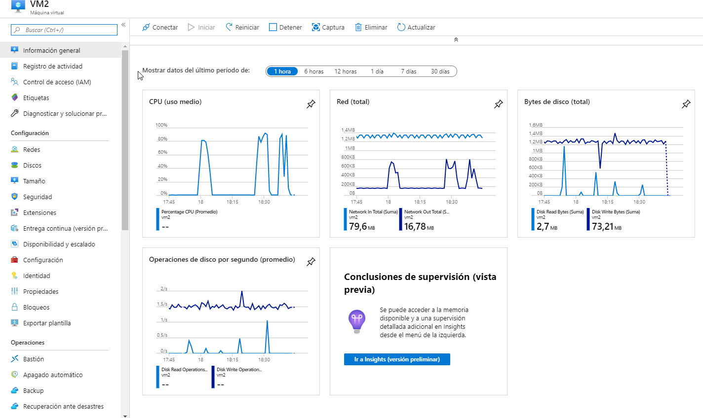

### Escuela Colombiana de Ingeniería
### Arquitecturas de Software - ARSW

###  Integrante

Juan Pablo Ospina Henao

## Parte 1

**Preguntas**

1. ¿Cuántos y cuáles recursos crea Azure junto con la VM?
Al crear una maquina virtual en azure esta necesita al menos los sigueintes 7 recursos :
    * Grupo de recursos
    * Opciones de disponibilidad
    * Discos 
    * Redes 
        * red virtual
        * Subred
        * IP publica 
        *Equilibirio de carga (Si se escoge la opcion)

2. ¿Brevemente describa para qué sirve cada recurso?
 * Grupo de recursos: sirver para contener todos los recursos que comparten los mismos permisos, ciclo de vida y directivas
* Opciones de disponibilidad: sirve para administrar la dispniibilidad y la resistencia de las aplicaciones 
* Discos: es para elegir los tipos de discos que Azire admite para el trabajo o el escenario.
* Redes 
    * red virtual: SI es necesario tneer el intervalo de redes para un determinado sistema, desde ahi se podra configurar desde las subredes hasta la configuracion de seguridad
    * Subred: 
    * IP publica: se usa esta direccion  IP para comunicar la maquina virtual desde fuera de la red virtual
    *Equilibirio de carga (Si se escoge la opcion): Esta opcion nos permite saber si esta habilitado la solucion del equilibrio de carga que tiene azure para un sistema determinado.
3. ¿Al cerrar la conexión ssh con la VM, por qué se cae la aplicación que ejecutamos con el comando `npm FibonacciApp.js`? ¿Por qué debemos crear un *Inbound port rule* antes de acceder al servicio?
    * Si solamente ejecutamos el coamndo `npm FibonacciApp.js` este corre la aplicacion pero cada vez que se cierre la conexion perdemos el proceso corriendo por lo cual es necesario implementar el de forever, ya que este comenado nos permite correr el servicio apenas la maquina se prenda.
    * El Inbound port rule* sirve para que la maquina virtual que estamos creando se pueda acceder por un puerto determiando, para este caso abrimos la aplicacion con el puerto 3000. 
4. Adjunte tabla de tiempos e interprete por qué la función tarda tando tiempo.

Debdido a que el numero de fibbonacci que se estaba calculando era relativamente alto y nuestra maquina virtual creada solo tiene la minima cantidad de ram y de cpu con respecto a las maquians disponibles en azure, tama sufeciente tiempo para determinar cada uno de estos valores.
5. Adjunte imágen del consumo de CPU de la VM e interprete por qué la función consume esa cantidad de CPU.

Por cada uno de las peticiones la maquina virtua tenia picos de utilizacion, en la imagne se puede ver los picos que se generaron en la cpu y se puiedne detallar cada una de las consultas
6. Adjunte la imagen del resumen de la ejecución de Postman. Interprete:

Primero debiamos realizar el cambio en este archivo de configruacion de postman:

Luego pasamos a ejecturar las peticiones dando los sigueintes resultados:

    * Tiempos de ejecución de cada petición.
    El tiempo total de ejecucion es de 5 minutos 
    * Si hubo fallos documentelos y explique.
    y tubo un total de 4 fallos, esto se daba escencialmente porque la maquina virtual estaba ocupada cuando se le realizaba la peticion, ya que estaba procesando todavia otra de las petciiones anteriores.

El consumo de cpu es:

7. ¿Cuál es la diferencia entre los tamaños `B2ms` y `B1ls` (no solo busque especificaciones de infraestructura)?
`B1ls` es la maquina mas basica que tiene azure y solamente cuenta con 1 cpu y 0,5 gb de memoria en cmabio B2ms cuenta con 2 vpcu y con 8 de memeoria ram 
tambien tiene mayor indicador de entrdas y salidad del servidor, por lo que puede tneer mejor disponibilidad con respecto a peticiones que se realicen.

8. ¿Aumentar el tamaño de la VM es una buena solución en este escenario?, ¿Qué pasa con la FibonacciApp cuando cambiamos el tamaño de la VM?
El cambio de tamaño lo que nos permite es procesas n un timepo menor cualqueir peticion pero de todas formas al ser peticiones concurrentes puee que no solucione el problema del todo.
* La aplicacion no sufre ninguna modificacion debido a que solo se cmabia su infraestructura.
9. ¿Qué pasa con la infraestructura cuando cambia el tamaño de la VM? ¿Qué efectos negativos implica?
El unico efecto negativo al cambiar toda la infraestructura es que se cambia de plan de cobro a uno superiror dependiendo del que se escoja, y mientras la mauquina se reinicia para su mejora, el servicio no esta disponible en ese tiempo. 
10. ¿Hubo mejora en el consumo de CPU o en los tiempos de respuesta? Si/No ¿Por qué?

si mejoro, pero no significativamente. EN promedio solmante por cada dato dsiminuiyo 2 - 3 segundos. esto se debe a el aumento de memoria de 0,5 a 8 y de cpu paso de 1 a 2.

11. Aumente la cantidad de ejecuciones paralelas del comando de postman a `4`. ¿El comportamiento del sistema es porcentualmente mejor?

** Postman

Para este caso tambien mejoror ya que se pudo resolver una peticion de mas.

y el consumo repectivo de la cpu en la maquina.

### Parte 2 - Escalabilidad horizontal

**Preguntas**

### ¿Cuáles son los tipos de balanceadores de carga en Azure y en qué se diferencian?, ¿Qué es SKU, qué tipos hay y en qué se diferencian?, ¿Por qué el balanceador de carga necesita una IP pública?
    * Existe dos tipos de balanceadores de carga uno publico clasico y inteno clasico. el publico clasico es que se puedne agregar diferentes direcciones front end y se equilibra las cargas a mas de una ip, en cambio el interno clasico solamnete da equilibrio a las maquinas virtuales que residen en una red virtual y se realiza gratuitamente.
    * un SKU es el nuemro de referencia y por cada uno de los servicios azure maneja un tipo de sku. La diferenteia ente un grupo en comun de sku puede ser performace y precio.
    * necesita una ip publica por que es la que garantiza el acercmaiento a el aplicativo ditribuido en la red. es decir todas las peticiones debe pasar por esa ip y luego si se distribuyen a cada una de las maquinas. 
### ¿Cuál es el propósito del *Backend Pool*?
Se refiere a todo un conjuneto de set de back end que recibe el trafico similar a la aplicacion principal. cada uno de los backends pueden estar deplegados en la misma o en diferetnes regiones. en otras palabras es un grupo de instancias de aplicaciones que recibe el mimso trafico y responde casi de ### ¿Cuál es el propósito del *Health Probe*?
Principalmente es el que detemina como estan los backend en cuanto a estado de performace y es el que determina a que maquinas deberia realizar las peticiones.
###  ¿Cuál es el propósito de la *Load Balancing Rule*? ¿Qué tipos de sesión persistente existen, por qué esto es importante y cómo puede afectar la escalabilidad del sistema?.

es el servicio que hace que se dirija el trafico a una plicacionque corre dentro de un nodo, si se cambia el puerto de salida de la apliucacion se debe tener presente en la regla.

### ¿Qué es una *Virtual Network*? ¿Qué es una *Subnet*? ¿Para qué sirven los *address space* y *address range*?* ¿Qué son las *Availability Zone* y por qué seleccionamos 3 diferentes zonas?. ¿Qué significa que una IP sea *zone-redundant*?

Una Virtual Network es una representación de una red propia en la nube. Es un aislamiento lógico de la nube de Azure dedicada a la suscripción del usuario. Puede utilizar VNets para aprovisionar y gestionar redes virtuales privadas (VPNs) en Azure y, opcionalmente, enlazar las VNets con otras VNets en Azure, o con una infraestructura de TI local.

Una Subnet es un rango de direcciones lógicas. Es una buena estrategia si se tiene una red de gran tamaño ya que al dividirla en subredes puede reducir el tamaño de dominios de broadcast y hacerla más fácil de administrar.

 *Availability Zone* es una oferta que se realiza para tener alta disponibilidad ya que potege sus aplicaciones y datos a fallas que puyedan ocurruir. las zonas de disponibilidad son ubicaicones ficias dentro de una region en azure.

### ¿Cuál es el propósito del *Network Security Group*?

Es filtrar el trafico de la red desde los recursos de uan red virutal con un grupo de seguridad de red. este debe contener las reglas de seguridad que permiten el paso del trafico o en dado caso que se queira negar el trafico debe estar estipulado en las reglas.
### Informe de newman 1 (Punto 2)

Primero se debe garatizar el funcionamiento de la red publica

y sus respectivas maquinas 

Para tres maquinas virtuales con 4 peticones en paralelo

Se pasa a crear otra maquina virtual.

Para CUATRO maquinas virtuales con 4 peticones en paralelo

Comparando el performace de tres maquinas a 4 se puede ver notablemente que no tienene problemas al momento de responder cada una de la speticiones y ademas, es menor el tiempo de ejecucion debido a que se tiene otro nodo mas el cual puede ser usado mientras las otras maquinas esten en funcionamiento. 

Por cada una de las maquinas se ve el rendimeinto de cpu que tienen,
Maquina virtual 1

Maquina virtual 2

Maquina virtual 3

Maquina virtual 4

Cada unad e las maquinas tiene un rendimeinto parecido por lo que s epuede determinar que si existe un balanceador de cargas. la maquina cuatro solo tiene un pico yua que en esta solo se relaiza la ultima peticion postman.

### Presente el Diagrama de Despliegue de la solución.

